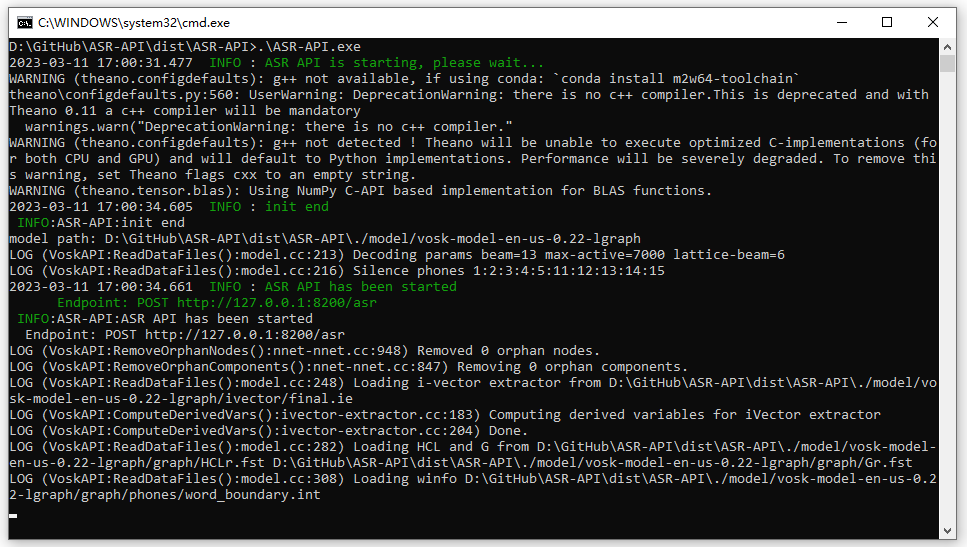
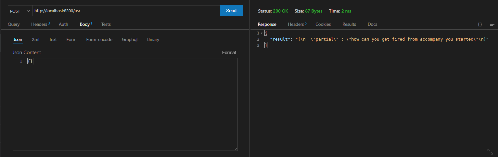
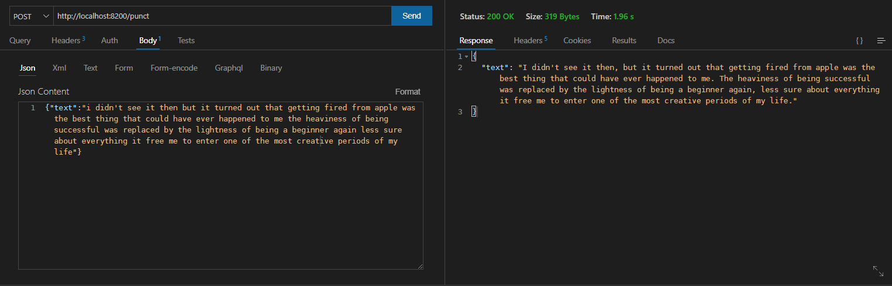

<p align="center">
    
</p>

<div align="center">
</div>
 
# Introduction

This is an ASR API server.

# Usage

- Download it from [release](https://github.com/rerender2021/ASR-API/releases)

- Unzip it, and click `run.bat`



# API

- Default host: `http://localhost:8200`
  
## POST /asr

- Description: offline stream asr, It returns the currently recognized text.
- Example:



## POST /punct

- Description: offline punctuation restoration    
- Example:




# Dev

- Install

```bash
> virtualenv venv --python=python3.8.10
> pip install -r requirements.txt
```

- Download models: [tag/upload-models](https://github.com/rerender2021/ASR-API/releases/tag/upload-models)

Then, adjust `model` folder structure like this:

```
- ...
- model
    - vosk-model-en-us-0.22-lgraph
        - am
        - conf
        - graph
        - ivector
    - INTERSPEECH-T-BRNN.pcl
- ...
- README.md
```

- Run

```bash
> dev
```

# Package

In virtual env:

```bash
> build
```

# License

[MIT](./LICENSE)
